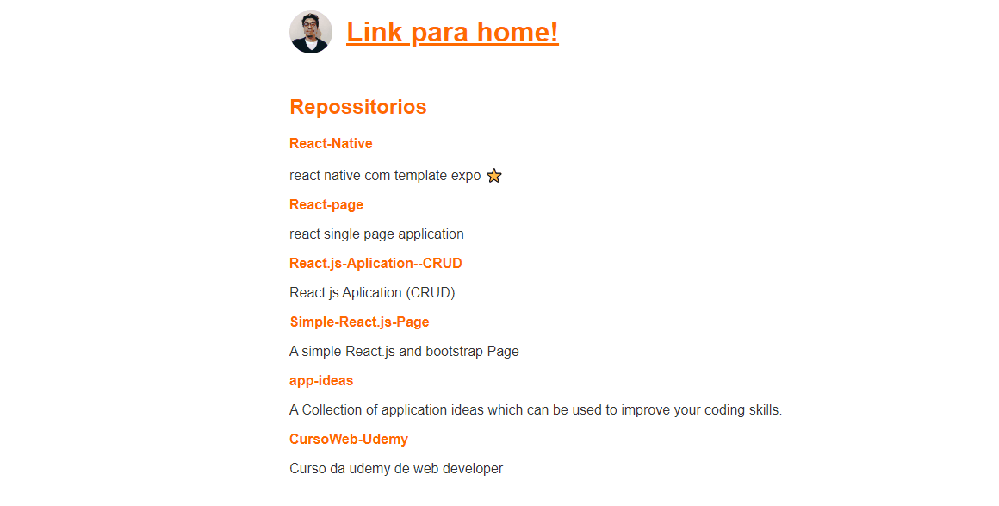

#  <p align=center> Blog with Next.js 👋</p> 





<hr/>

<br>
<br>

## 🔍 About

<p>This is not a big project but it's important becose this project make me learn de basics and fall in love with React.  </p>
<p>it's a simple app made with next.js a realy  good  flamework, in thi project I fetch the api of the github and repoitore for more information please lauch demo.</p>

<br>
<br>

## 🚀 Demo
Just dowload and  run the following command at the root:

```sh
on work!
```


<br>
<br>

## ✨ Technologies used on this project

<ul>
    <li> React
    <li> Next.js
    <li> Styled-components
    <li> Html / Css
</ul>

<br>
<br>

## 📝 License

This project is [MIT](https://github.com/gustavobacellarladeira/Blog-React.js/blob/master/LICENSE) licensed.

<hr/>

Made with <span style = "color: red">♥</span> by Gustavo Bacellar 👋 <a href="https://www.linkedin.com/in/gustavo-bacellar/?msgControlName=reply_to_sender&msgConversationId=6714883939833561088&msgOverlay=true">Get in touch!</a>